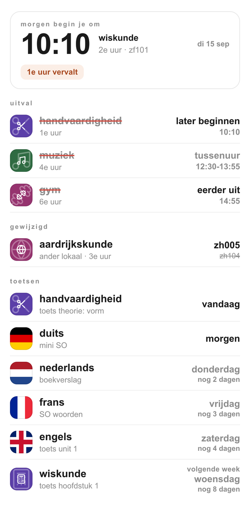

# noah-rooster-ntfy

Leest Noahs weekrooster uit Somtoday en pusht wijzigingen naar ntfy.

Meldt uitval, verplaatsingen, lokaalwijzigingen en nieuwe toetsen/huiswerk.
Draait als GitHub Action: doordeweeks elk uur tijdens schooltijd, plus een
vast bericht om 07:15 en om 17:30 (Europe/Amsterdam, dus geen gedoe met zomertijd).

## De melding

De tekst is wat je op het lockscherm leest zonder te openen.

    Morgen school 9.00
    - duits toets (SO, 3e uur)
    - muziek vervalt (5e uur)
    - wiskunde vervalt (donderdag, 2e uur)

Toetsen en wijzigingen hebben bewust een verschillend bereik. Een **toets**
staat er alleen als hij op de dag uit de titel valt; verder vooruit kijk je op
de kaart, want daar heb je nu toch niets mee te doen. Een **wijziging** staat er
ook als hij verderop valt (binnen drie dagen), met de dagnaam erbij - die wil je
weten zodra hij bekend is, en de kaart toont hem niet omdat die over een dag
gaat. Valt iets op de dag uit de titel, dan blijft de dagnaam weg: "muziek
vervalt (5e uur)".

De kaart erbij heeft de rest. Bovenaan staat waar het om draait: hoe laat je
moet beginnen, en waarom dat afwijkt als het afwijkt. Daaronder de uitval van
die ene dag - met wat het betekent, want een tussenuur is iets anders dan naar
huis mogen - en de toetsen tot veertien dagen vooruit.

Zelf renderen met demo-data: `python3 rooster_kaart.py uit.png`.

## Hoe het werkt

Het rooster komt uit `/rest/v1/afspraakitems/{leerlingId}/jaar/{jaar}/week/{week}`
van de niet-officiele Somtoday-API. Dat endpoint geeft `wijzigingOmschrijving`
mee ("Les vervalt", "De les is verplaatst (komt van ma 9:00u)"). Let op: het
oudere `/rest/v1/afspraken` laat uitgevallen lessen simpelweg weg en is dus
onbruikbaar hiervoor.

Toetsen en huiswerk komen uit `/rest/v1/studiewijzeritemafspraaktoekenningen`
en worden op begintijd aan een les gekoppeld. Docenten voeren een SO regelmatig
in als `HUISWERK` in plaats van `TOETS`, dus filter niet op type.

`state.json` bewaart de vorige stand; `check` meldt alleen het verschil. In de
repo staat hij versleuteld als `state.enc`, met hetzelfde wachtwoord als het
token - er staan vakken, lokalen, docenten en toetsonderwerpen van een kind in,
en dat hoort niet leesbaar in een repo.

De kaart wordt opgebouwd als HTML en met headless Chrome naar PNG geschreven
(`rooster_kaart.py`). Chrome staat op een GitHub-runner al klaar, dus Playwright
gebruikt die via `channel="chrome"` en hoeft er geen te downloaden. Kleuren-emoji
waren er niet nodig: de vakiconen zijn Lucide-SVG's die in `vakiconen.py` staan
ingebakken. Talen krijgen geen icoon maar een vlag als achtergrond - Lucide
heeft niets dat duits van frans onderscheidt. De vlaggen zijn CSS-gradients;
de Union Jack is vereenvoudigd (geen diagonalen), want die zijn zo niet netjes
te maken en op 36 pixels zie je het verschil niet.

Twee dingen waar de data tegenwerkt. Uitgevallen lessen komen met een afkorting
als vaknaam ("mu" in plaats van "muziek"); die zoeken we op via docent+lokaal en
anders via weekdag+lesuur, en we vullen alleen in bij precies een kandidaat -
een verkeerde naam is erger dan een afkorting. En de runner draait op UTC, dus
alle tijdvergelijkingen lopen via `nu_nl()`, anders kiest het startblok een les
die allang bezig is.

## Commando's

    python3 somtoday_rooster.py login              # eenmalig, via de browser
    python3 somtoday_rooster.py rooster            # weekrooster in de terminal
    python3 somtoday_rooster.py check              # wat is er veranderd
    python3 somtoday_rooster.py check --notify --kaart

Bij `check`: `--dagen` is het venster voor wijzigingen (standaard 3), `--vooruit`
dat voor toetsen op de kaart (standaard 14), `--altijd` pusht ook als er niets
veranderd is, en `--reset` legt de beginstand opnieuw vast.

Een run handmatig uitlokken zonder te wachten:

    gh workflow run rooster.yml --repo mattijn/noah-rooster-ntfy -f altijd=true

## Belangrijk: maar een plek tegelijk

Het refresh token roteert bij elke API-call, en hergebruik van een oud token
laat Somtoday de hele tokenfamilie intrekken. Draai dit dus **nooit** tegelijk
lokaal en in de Action. De workflow gebruikt daarom `concurrency` zonder
cancel-in-progress.

## Opnieuw inloggen na uitsluiting

Zie je in de logs `invalid_grant: Token revoked`, dan is opnieuw inloggen nodig.
Op de Mac, met SomtodayCallback.app in ~/Applications:

    python3 somtoday_rooster.py login
    TOKEN_PASS=<wachtwoord> openssl enc -aes-256-cbc -pbkdf2 -salt \
        -in tokens.json -out tokens.enc -pass env:TOKEN_PASS
    git add tokens.enc && git commit -m "opnieuw ingelogd" && git push

## Secrets

- `TOKEN_PASS` - wachtwoord waarmee `tokens.enc` en `state.enc` versleuteld zijn
- `NTFY_TOPIC` - ntfy-topic waar de meldingen heen gaan
